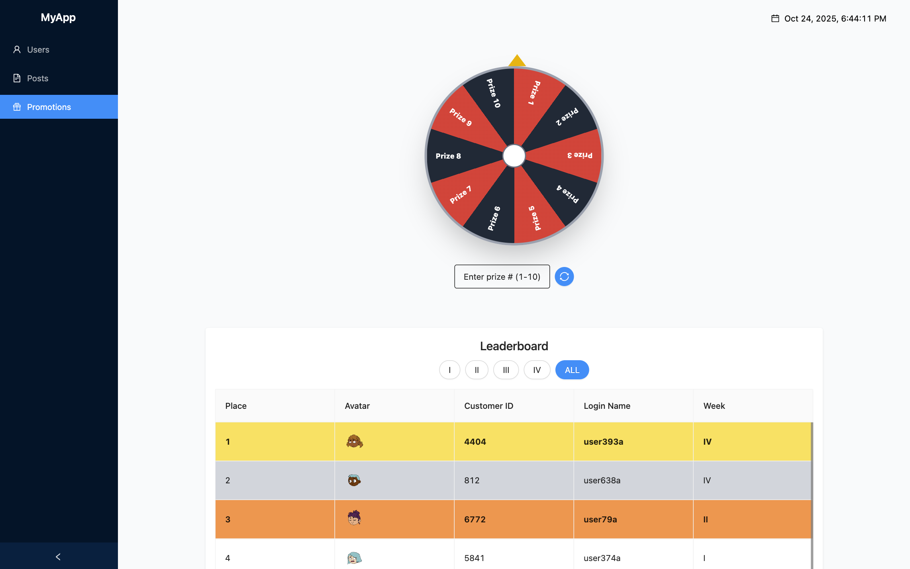
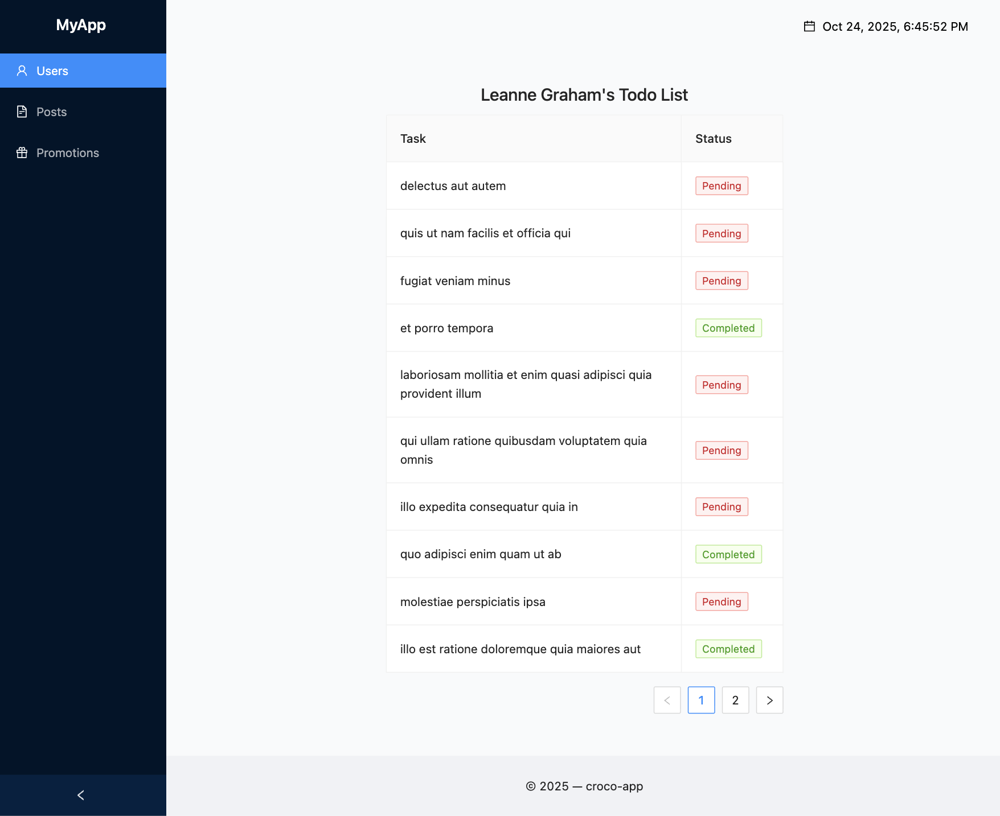
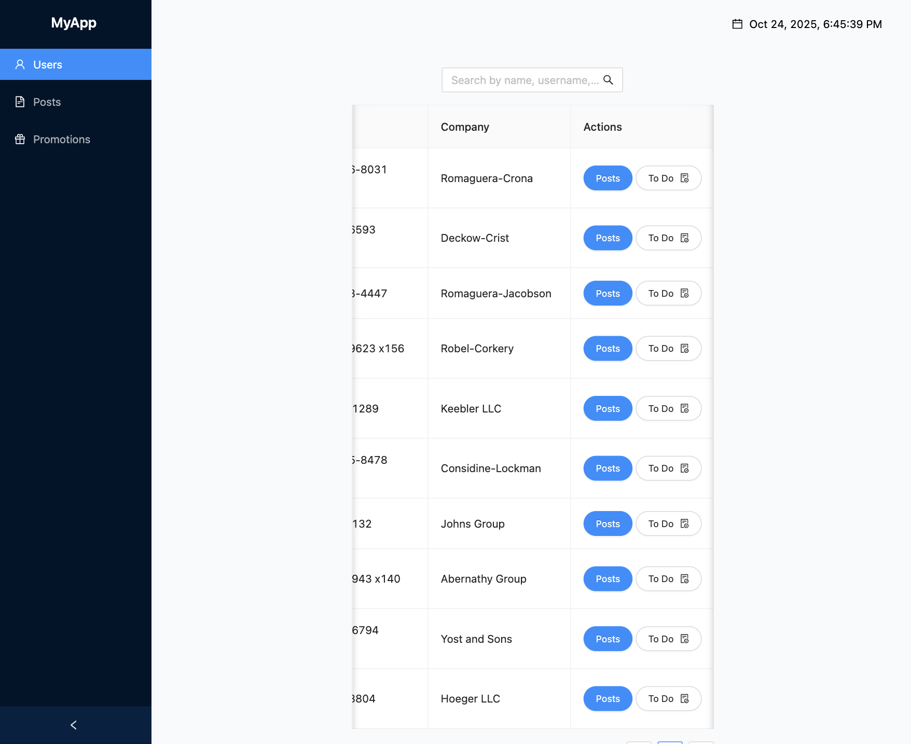
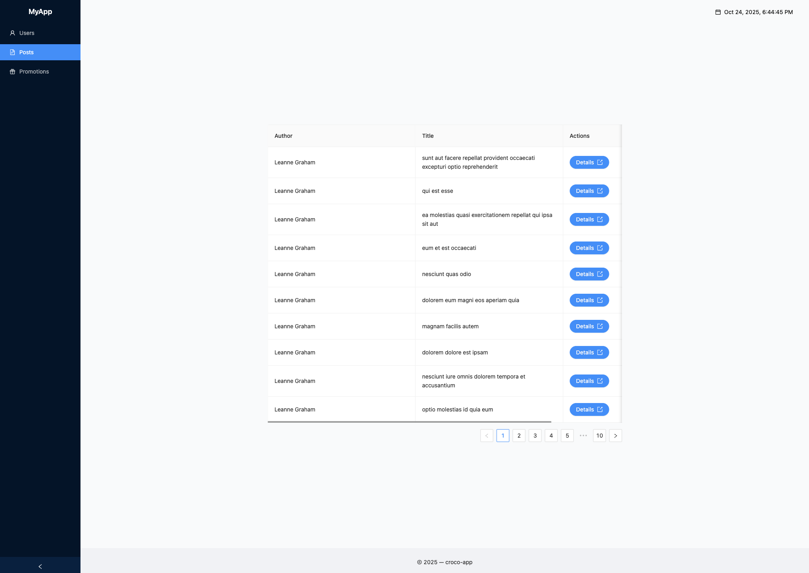

# 🌐 Angular User & Posts Dashboard

---

## 🌟 Project Overview

An Angular web application built for practicing component-based architecture, routing, and API integration.
The app displays users, posts, todos, and promotional features such as a spinning wheel and leaderboard — all using responsive design and modern Angular best practices.

---

## 🧭 Main Structure

- **Header** – Displays site name (links to home) and current date & time.

- **Sidebar Navigation** – Links to Users, Posts, and Promotions pages.

- **Main Content Area** – Shows data tables and interactive components.

- **Footer** – Simple footer for layout consistency.

---

## 🖼 Screenshots

### promotions



### Todos



### Home / Users List



### Posts List



---

## ⚡ Main Technologies Used

- **Angular** – Frontend framework
- **TailwindCSS** – Styling framework
- **Ant Design** – UI components

---

## ⚙️ Installation

1. Clone the repository:
   ```bash
   git clone https://github.com/Omiadze/Angular-Intern---Task.git
   ```
2. Navigate to the project directory:
   ```bash
   cd Angular-Intern---Task
   ```
3. Install dependencies:
   ```bash
   npm install
   ```
4. Start the development server:

   ```bash
   ng serve
   ```

# Live Site

Access the live application at [app](https://startling-druid-775324.netlify.app).

# Author

Hi, my name is Teo and I am a front-end developer.
